# Diagramme de référence Pipe V6



_Source Mermaid ci-dessous et version éditable dans `docs/diagrams/pipe_v6_flowchart.mmd`._

```mermaid
flowchart TD

    %% Entrée CRM
    A[CSV CRM<br/>(nom client, n° voie, voie, CP, code INSEE/JINSEI...)] --> B[Détection communes<br/>INSEE en priorité, sinon CP+ville]

    %% SIRENE source de vérité
    B --> C[Appels API SIRENE<br/>par commune + pagination]
    C --> D[(Cache SQLite SIRENE<br/>établissements par commune)]

    %% LLM #1
    A --> E[LLM #1 via Ollama<br/>Normalisation nom + adresse<br/>+ tag PUBLIC/PRIVE/EQUIPEMENT]
    E --> E1[CRM enrichi<br/>nom/adresse normalisés<br/>+ catégorie CRM]

    %% Requêtes INPI / DataGouv
    E1 --> F[Construction requêtes<br/>INPI RNE + DataGouv<br/>(nom normalisé + commune)]
    F --> H[API INPI RNE]
    F --> I[API Recherche entreprise<br/>annuaire-entreprises.data.gouv.fr]

    %% Requêtes Qwant (3 sites)
    A --> G[Construction requête Qwant commune<br/>(nom brut + n° voie + voie + CP)]
    G --> J1[Qwant<br/>site:pappers.fr]
    G --> J2[Qwant<br/>site:annuaire-entreprises.data.gouv.fr]
    G --> J3[Qwant<br/>site:societe.com]

    %% Collecte candidats
    H --> K[Collecte SIREN/SIRET candidats]
    I --> K
    J1 --> K
    J2 --> K
    J3 --> K

    K --> L[Déduplication candidats<br/>(max 10 / source)]
    L --> M[Lookup SIREN/SIRET<br/>dans cache SQLite SIRENE<br/>(ou API si manquant)]
    M --> N[JSON candidats normalisés<br/>+ infos SIRENE<br/>+ provenance + type juridique]

    %% LLM #2 arbitrage
    A --> O[Contexte CRM brut]
    E1 --> O
    N --> P[LLM #2 via Ollama<br/>Comparaison CRM vs candidats<br/>avec filtre public/privé/équipement]

    P --> Q{Candidat fiable ?}

    Q -->|Oui| R[Sortie MATCH<br/>SIRET retenu<br/>+ score confiance<br/>+ sources impliquées]
    Q -->|Non| S[Sortie REVIEW ou NO_MATCH<br/>(incl. cas équipement urbain)]

    R & S --> T[Export final<br/>CSV/JSON pour CRM<br/>+ métriques/logs]
```

---

## Plan de développement complet pour Codex

Je pars du principe que :

* langage : **Python**
* orchestrateur : un script CLI type `scripts/run_pipe_v6.py`
* structure : package `src/pipe_v6/` (noms adaptables à ton repo actuel)
* LLM : **Ollama** (`http://localhost:11434`, modèle `gpt-oss:20b`)

Pour chaque tâche :

* **But** : objectif
* **Entrées / Sorties**
* **Implémentation** : ce que Codex doit coder

---

### 0. Structuration du projet et configuration

#### Tâche 0.1 – Créer/adapter le package `pipe_v6`

* **But** : isoler proprement le pipe V6.
* **Entrées** : repo existant.
* **Sorties** : dossier `src/pipe_v6/` avec `__init__.py`.
* **Implémentation** :

  * Créer `src/pipe_v6/__init__.py`.
  * Prévoir sous-modules :

    * `crm_loader.py`
    * `commune_detection.py`
    * `sirene_client.py`
    * `sirene_cache.py`
    * `llm_normalizer.py`
    * `external_sources.py`
    * `candidate_store.py`
    * `category_mapping.py`
    * `llm_matcher.py`
    * `exporter.py`
    * `pipeline.py`
    * `config.py`
    * `logging_utils.py`

---

#### Tâche 0.2 – Mettre en place la configuration centralisée

* **But** : rassembler seuils, URLs, chemins dans un seul objet.
* **Entrées** : `config.yaml` ou env.
* **Sorties** : `pipe_v6/config.py`.
* **Implémentation** :

  * Créer une dataclass `PipelineConfig` :

    * chemins : `crm_path`, `output_path`, `sqlite_path`, `log_path`
    * API : `sirene_api_url`, `sirene_token`, `rne_api_url`, `rne_client_id`, `rne_client_secret`, `qwant_base_url`
    * LLM : `model_name` (par défaut `gpt-oss:20b`), `temperature=0.0`, `top_p=1.0`, `max_tokens`
    * limites : `max_candidates_per_source=10`, `confidence_auto_match=0.85`, `confidence_review_min=0.6`
  * Ajouter un loader `load_config(path: Path | None) -> PipelineConfig` :

    * charge un YAML si présent,
    * sinon lit des variables d’environnement avec des valeurs par défaut.

---

#### Tâche 0.3 – Mettre en place le logging

* **But** : traçabilité (debug, stats).
* **Entrées** : `PipelineConfig`.
* **Sorties** : `pipe_v6/logging_utils.py`.
* **Implémentation** :

  * Fonction `setup_logging(config: PipelineConfig) -> logging.Logger`.
  * Format : horodatage + niveau + module.
  * Niveau paramétrable (config).

---

### 1. Ingestion CRM et détection des communes

#### Tâche 1.1 – Loader CRM CSV avec mapping de colonnes

* **But** : charger le CRM avec un mapping configurable.
* **Entrées** : chemin CSV, noms de colonnes.
* **Sorties** : `pandas.DataFrame` standardisé.
* **Implémentation (`crm_loader.py`)** :

  * Fonction `load_crm(path: Path, column_map: dict) -> pd.DataFrame`.
  * `column_map` :

    * `"name"` → col nom client
    * `"street_number"` → numéro de voie
    * `"street_name"` → nom de voie
    * `"postcode"` → CP
    * `"city"` → commune
    * `"insee"` → code INSEE/JINSEI si dispo
  * Renvoi d’un DF avec colonnes internes fixées : `crm_name`, `street_number`, `street_name`, `postcode`, `city`, `insee_code`, plus un `crm_id` (index ou colonne clé).

---

#### Tâche 1.2 – Détection des communes uniques à traiter

* **But** : liste des communes pour requêtes SIRENE.
* **Entrées** : DF CRM.
* **Sorties** : liste de communes standardisées.
* **Implémentation (`commune_detection.py`)** :

  * Dataclass `CommuneKey` : `insee_code: str | None`, `postcode: str | None`, `city: str | None`.
  * Fonction `extract_communes(df: pd.DataFrame) -> list[CommuneKey]` :

    * Si `insee_code` présent → clé = INSEE (unique).
    * Sinon groupby sur `(postcode, city)` (strip/upper city).

---

### 2. Client SIRENE et cache SQLite

#### Tâche 2.1 – Définir le schéma SQLite

* **But** : stockage local des établissements par commune.
* **Entrées** : structure SIRENE JSON.
* **Sorties** : script de création de tables.
* **Implémentation (`sirene_cache.py`)** :

  * Fonction `init_db(path: Path)`.
  * Tables :

    * `establishments` :

      * `siret` (PK, TEXT)
      * `siren` (TEXT)
      * `nic` (TEXT)
      * `denomination` (TEXT)
      * `enseigne1` (TEXT)
      * `street_number` (TEXT)
      * `street_type` (TEXT)
      * `street_name` (TEXT)
      * `postcode` (TEXT)
      * `city` (TEXT)
      * `insee_code` (TEXT, index)
      * `legal_nature` (TEXT)
      * `created_at` (TIMESTAMP)
      * `source_raw` (JSON) pour debug.
    * Index utile sur `(insee_code)`, `(siret)`, `(siren)`.

---

#### Tâche 2.2 – Implémenter le client API SIRENE

* **But** : télécharger tous les établissements d’une commune.
* **Entrées** : `CommuneKey`, config API.
* **Sorties** : liste de records JSON SIRENE.
* **Implémentation (`sirene_client.py`)** :

  * Fonction `fetch_establishments_for_commune(commune: CommuneKey, config: PipelineConfig, logger) -> list[dict]`

    * Construction du filtre :

      * si `insee_code` dispo : `codeCommuneEtablissement:XXXXXX`
      * sinon : filtre sur `codePostalEtablissement` + éventuellement `libelleCommuneEtablissement`.
    * Pagination (boucle jusqu’à `total_results` atteint).
    * Retry simple (ex. 3 tentatives, backoff).
    * Log nombre d’établissements récupérés.

---

#### Tâche 2.3 – Remplir/mettre à jour le cache SQLite avec SIRENE

* **But** : écrire les données SIRENE dans le cache.
* **Entrées** : liste JSON SIRENE.
* **Sorties** : DB à jour.
* **Implémentation (`sirene_cache.py`)** :

  * Fonction `upsert_establishments(records: list[dict], conn: sqlite3.Connection)`.
  * Map JSON → colonnes `establishments`.
  * Upsert sur `siret` (INSERT OR REPLACE).

---

#### Tâche 2.4 – Fonction de chargement SIRENE par commune avec cache

* **But** : ne télécharger que ce qui manque.
* **Entrées** : `CommuneKey`.
* **Sorties** : établissements SIRENE de la commune.
* **Implémentation (`sirene_cache.py` + `sirene_client.py`)** :

  * Fonction `get_or_fetch_commune(commune: CommuneKey, config, logger) -> list[dict]` :

    * Vérifie dans SQLite : `SELECT count(*) FROM establishments WHERE insee_code = ? OR (postcode=? AND city=?)`.
    * Si count > 0 → retourne les enregistrements existants.
    * Sinon → appelle `fetch_establishments_for_commune` puis `upsert_establishments`, puis relit.

---

### 3. LLM #1 – Normalisation et catégorisation

#### Tâche 3.1 – Wrapper Ollama générique

* **But** : centraliser les appels au modèle local.
* **Entrées** : `prompt`, `model_name`.
* **Sorties** : texte brut.
* **Implémentation (`llm_normalizer.py` ou `llm_utils.py`)** :

  * Fonction `call_ollama(prompt: str, config: PipelineConfig) -> str` :

    * POST sur `http://localhost:11434/api/generate`.
    * Paramètres : `model`, `prompt`, `temperature=0`, `top_p=1`, `stream=false`.
    * Retourne le champ `response`.

---

#### Tâche 3.2 – Définir le format JSON pour le LLM #1

* **But** : contrat stable.
* **Entrées** : nom/adresse CRM.
* **Sorties** : structure Python.
* **Implémentation (`llm_normalizer.py`)** :

  * Dataclass `NormalizedCRMEntry` :

    * `normalized_name: str`
    * `normalized_address: str`
    * `category: Literal["PUBLIC", "PRIVE", "EQUIPEMENT_URBAIN", "INCONNU"]`
  * Fonction `parse_normalizer_output(raw: str) -> NormalizedCRMEntry` :

    * `json.loads` + validation (catégorie dans l’énum, champs non vides).
    * Gestion d’erreur : log + exception explicite.

---

#### Tâche 3.3 – Prompt et fonction LLM #1

* **But** : normaliser nom + adresse et catégoriser.
* **Entrées** : ligne CRM.
* **Sorties** : `NormalizedCRMEntry`.
* **Implémentation (`llm_normalizer.py`)** :

  * Fonction `normalize_crm_entry(row: pd.Series, config, logger) -> NormalizedCRMEntry`.
  * Prompt (dans un template Python) :

    * Décrire clairement :

      * Nouvel objet JSON obligatoire.
      * `normalized_name` en majuscules, sans mentions de type "SITE 1", "AGENCE", "BUREAU", sans commune.
      * `normalized_address` en majuscules, format proche SIRENE (n° + voie).
      * `category` avec définition très stricte de PUBLIC/PRIVE/EQUIPEMENT_URBAIN/INCONNU.
    * Fournir 3–4 exemples dans le prompt.
  * Appel `call_ollama`.
  * Parse avec `parse_normalizer_output`.

---

### 4. Clients externes : INPI/RNE, DataGouv, Qwant

#### Tâche 4.1 – Définir la structure d’un candidat brut

* **But** : type commun pour tous les candidats avant normalisation SIRENE.
* **Entrées** : résultats INPI/DataGouv/Qwant.
* **Sorties** : dataclass.
* **Implémentation (`candidate_store.py`)** :

  * Dataclass `RawCandidate` :

    * `source: Literal["RNE", "DATAGOUV", "QWANT_PAPPERS", "QWANT_ANNUAIRE", "QWANT_SOCIETE"]`
    * `siren: str | None`
    * `siret: str | None`
    * `label: str | None` (nom tel que vu dans la source)
    * `url: str | None`
    * `extra: dict` (pour debug).

---

#### Tâche 4.2 – Client API RNE (INPI)

* **But** : extraire des SIREN/SIRET candidats.
* **Entrées** : `normalized_name`, commune.
* **Sorties** : liste de `RawCandidate`.
* **Implémentation (`external_sources.py`)** :

  * Fonction `search_rne(normalized_name: str, city: str, config, logger) -> list[RawCandidate]`.
  * Construction de la requête selon doc RNE.
  * Parsing :

    * Pour chaque résultat : récupérer SIREN/SIRET si présents.
  * Tronquer à `config.max_candidates_per_source`.

---

#### Tâche 4.3 – Client DataGouv – recherche entreprise

* **But** : candidats via annuaire-entreprises.
* **Entrées** : `normalized_name`, commune.
* **Sorties** : `list[RawCandidate]`.
* **Implémentation (`external_sources.py`)** :

  * Fonction `search_datagouv(normalized_name: str, city: str, config, logger)`.
  * Appel sur l’API de recherche entreprise (data.gouv / annuaire-entreprises).
  * Parsing des SIREN/SIRET.
  * Limite à 10.

---

#### Tâche 4.4 – Client Qwant générique

* **But** : pouvoir lancer des recherches Qwant paramétrables.
* **Entrées** : requête texte, `site:`.
* **Sorties** : résultats bruts Qwant.
* **Implémentation (`external_sources.py`)** :

  * Fonction `qwant_search(query: str, config, logger) -> list[dict]`.
  * Gestion des entêtes User-Agent, etc.
  * Gestion taux de requêtes (facile d’ajouter un sleep global plus tard).

---

#### Tâche 4.5 – Extraction SIREN/SIRET depuis une URL

* **But** : retrouver SIREN/SIRET dans les URLs Pappers / Societe / Annuaire.
* **Entrées** : `url: str`.
* **Sorties** : `siren: str | None`, `siret: str | None`.
* **Implémentation (`external_sources.py`)** :

  * Fonction `extract_siren_siret_from_url(url: str) -> tuple[str | None, str | None]` :

    * Regex pour 9 chiffres consécutifs (SIREN) et 14 chiffres (SIRET).
    * Special cases :

      * si 14 chiffres → c’est un SIRET, SIREN = 9 premiers.
      * si plusieurs patterns → garder le dernier ou le plus "cohérent" (docstring claire).

---

#### Tâche 4.6 – Recherche Qwant pour les 3 sites

* **But** : lancer les 3 recherches parallèles/logiques.
* **Entrées** : nom brut CRM, n° voie, voie, CP.
* **Sorties** : `list[RawCandidate]`.
* **Implémentation (`external_sources.py`)** :

  * Fonction `search_qwant_sites(row: pd.Series, config, logger) -> list[RawCandidate]`.
  * Construire la requête texte commune :

    * `"{crm_name} {street_number} {street_name} {postcode}"`
  * Construire 3 requêtes :

    * `query_pappers = base_query + " site:pappers.fr"`
    * `query_annuaire = base_query + " site:annuaire-entreprises.data.gouv.fr"`
    * `query_societe = base_query + " site:societe.com"`
  * Pour chaque requête :

    * Appeler `qwant_search`.
    * Boucler sur les résultats, extraire URL, SIREN/SIRET via `extract_siren_siret_from_url`.
    * Créer des `RawCandidate` avec source correspondante.
    * Limiter à `max_candidates_per_source`.

---

### 5. Agrégation et normalisation des candidats (via SIRENE)

#### Tâche 5.1 – Déduplication de candidats bruts

* **But** : regrouper par SIRET/SIREN.
* **Entrées** : `list[RawCandidate]` RNE + DataGouv + Qwant.
* **Sorties** : `dict[key -> RawCandidate...]`.
* **Implémentation (`candidate_store.py`)** :

  * Clé de déduplication :

    * si `siret` présent → clé = `("siret", siret)`
    * sinon, si `siren` présent → clé = `("siren", siren)`
  * Grouper toutes les occurrences sous la même clé, concaténer `source` dans une liste.

---

#### Tâche 5.2 – Définir la structure d’un candidat normalisé SIRENE

* **But** : représentation enrichie.
* **Entrées** : groupe de `RawCandidate` + DB SIRENE.
* **Sorties** : dataclass.
* **Implémentation (`candidate_store.py`)** :

  * Dataclass `NormalizedCandidate` :

    * `siren: str`
    * `siret: str | None`
    * `name: str`
    * `address: str`
    * `postcode: str`
    * `city: str`
    * `insee_code: str | None`
    * `legal_nature: str | None`
    * `sources: list[str]`
    * `raw_candidates: list[RawCandidate]`

---

#### Tâche 5.3 – Lookup SIRENE pour enrichir les candidats

* **But** : transformer des SIREN/SIRET en candidats normalisés.
* **Entrées** : groupes de candidats, connexion SQLite.
* **Sorties** : `list[NormalizedCandidate]`.
* **Implémentation (`candidate_store.py` + `sirene_cache.py`)** :

  * Fonction `enrich_candidates_from_sirene(groups: dict, conn) -> list[NormalizedCandidate]` :

    * Si SIRET connu : `SELECT ... FROM establishments WHERE siret = ?`.
    * Sinon, SIREN : éventuellement chercher plusieurs établissements (peut être un point à raffiner plus tard).
    * Construire une adresse concaténée `"{street_number} {street_type} {street_name}"`.
    * Remplir `NormalizedCandidate`.

---

### 6. Mapping catégorie PUBLIC/PRIVE/EQUIPEMENT côté SIRENE

#### Tâche 6.1 – Définir la fonction de mapping légal → catégorie

* **But** : cohérence avec le tag LLM.
* **Entrées** : `legal_nature`, éventuellement d’autres champs.
* **Sorties** : `"PUBLIC" | "PRIVE" | "EQUIPEMENT_URBAIN"`.
* **Implémentation (`category_mapping.py`)** :

  * Fonction `map_legal_to_category(legal_nature: str | None) -> str`.
  * Table de correspondance (dictionnaire hardcodé) :

    * collectivités, EPA, EPIC, etc. → `PUBLIC`
    * sociétés commerciales, artisans, etc. → `PRIVE`
    * (optionnel) certains codes spécifiques d’infrastructure → `EQUIPEMENT_URBAIN` ou `INCONNU`.

---

#### Tâche 6.2 – Annoter les `NormalizedCandidate` avec la catégorie SIRENE

* **But** : préparer l’arbitrage filtré.
* **Entrées** : `list[NormalizedCandidate]`.
* **Sorties** : candidats avec attribut `category`.
* **Implémentation (`category_mapping.py`)** :

  * Ajouter `category: str` à `NormalizedCandidate`.
  * Fonction `assign_candidate_categories(candidates: list[NormalizedCandidate]) -> None` :

    * Pour chaque candidat, appliquer `map_legal_to_category`.

---

### 7. LLM #2 – Arbitrage et NO_MATCH

#### Tâche 7.1 – Définir le format de sortie LLM #2

* **But** : contrat clair.
* **Entrées** : CRM + candidats.
* **Sorties** : dataclass.
* **Implémentation (`llm_matcher.py`)** :

  * Dataclass `LLMMatchDecision` :

    * `decision: Literal["BEST_MATCH", "NO_MATCH"]`
    * `chosen_siret: str | None`
    * `confidence: float`
    * `reason: str | None`
  * Parser JSON : `parse_match_decision(raw: str) -> LLMMatchDecision`.

---

#### Tâche 7.2 – Pré-filtrer les candidats selon la catégorie CRM

* **But** : n’exposer au LLM que les candidats cohérents.
* **Entrées** : `NormalizedCRMEntry`, candidats.
* **Sorties** : liste filtrée pour LLM.
* **Implémentation (`llm_matcher.py` ou `category_mapping.py`)** :

  * Fonction `filter_candidates_by_category(crm_category: str, candidates: list[NormalizedCandidate]) -> list[NormalizedCandidate]`.

    * Si `crm_category == "PUBLIC"` : garder `candidate.category == "PUBLIC"`.
    * Si aucun → possibilité de repasser les `PRIVE` (optionnel, paramétrable).
    * Si `crm_category == "EQUIPEMENT_URBAIN"` : garder tout mais préparer à ce que le LLM utilise souvent NO_MATCH.
    * Si `INCONNU` : ne pas filtrer.

---

#### Tâche 7.3 – Construire le prompt LLM #2

* **But** : donner au LLM tous les éléments pour comparer.
* **Entrées** : ligne CRM brute, `NormalizedCRMEntry`, candidats filtrés.
* **Sorties** : `prompt: str`.
* **Implémentation (`llm_matcher.py`)** :

  * Fonction `build_matcher_prompt(row: pd.Series, norm_entry: NormalizedCRMEntry, candidates: list[NormalizedCandidate]) -> str`.
  * Contenu :

    * Rappel : tu dois répondre **uniquement** en JSON.
    * Données CRM brutes (nom, adresse, commune).
    * Données normalisées (nom/adresse + catégorie).
    * Liste numérotée de candidats (1..N), pour chacun :

      * nom, adresse, commune, catégorie SIRENE, liste de sources, INSEE, SIRET.
    * Règles :

      * Si un candidat apparaît dans plusieurs sources → indicateur de confiance.
      * Importance de la cohérence adresse + ville.
      * Prendre en compte catégorie CRM vs catégorie SIRENE.
      * Si aucun candidat ne paraît sûr → `decision = "NO_MATCH"`.
    * Format JSON final attendu.

---

#### Tâche 7.4 – Implémenter la fonction d’arbitrage LLM #2

* **But** : obtenir une proposition de match ou non.
* **Entrées** : row CRM, `NormalizedCRMEntry`, `NormalizedCandidate` list.
* **Sorties** : `LLMMatchDecision`.
* **Implémentation (`llm_matcher.py`)** :

  * Fonction `decide_match(row, norm_entry, candidates, config, logger) -> LLMMatchDecision`.
  * Appel `build_matcher_prompt`, puis `call_ollama`, puis `parse_match_decision`.
  * Gestion des erreurs JSON → fallback `NO_MATCH` avec confiance 0.

---

#### Tâche 7.5 – Appliquer les seuils MATCH / REVIEW / NO_MATCH

* **But** : transformer la décision LLM en statut produit.
* **Entrées** : `LLMMatchDecision`, config.
* **Sorties** : statut `MATCH` / `REVIEW` / `NO_MATCH`.
* **Implémentation (`llm_matcher.py` ou `pipeline.py`)** :

  * Fonction `classify_final_status(decision: LLMMatchDecision, config) -> Literal["MATCH", "REVIEW", "NO_MATCH"]`.

    * Si `decision.decision == "NO_MATCH"` → `NO_MATCH`.
    * Sinon :

      * `confidence >= confidence_auto_match` → `MATCH`.
      * `confidence >= confidence_review_min` → `REVIEW`.
      * sinon → `NO_MATCH`.

---

### 8. Orchestration globale du pipe

#### Tâche 8.1 – Pipeline par commune (préchargement SIRENE)

* **But** : préparer le cache pour toutes les communes.
* **Entrées** : liste `CommuneKey`.
* **Sorties** : cache SQLite rempli.
* **Implémentation (`pipeline.py`)** :

  * Fonction `preload_sirene(communes, config, logger)`.
  * Boucle sur chaque commune :

    * `get_or_fetch_commune`.

---

#### Tâche 8.2 – Pipeline par ligne CRM

* **But** : traiter une ligne de bout en bout.
* **Entrées** : row CRM, connexion SQLite.
* **Sorties** : dict résultat final.
* **Implémentation (`pipeline.py`)** :

  * Fonction `process_crm_row(row, config, conn, logger) -> dict` :

    1. Appel `normalize_crm_entry` (LLM #1).
    2. Appel `search_rne` + `search_datagouv` + `search_qwant_sites`.
    3. Agrégation en `RawCandidate` list.
    4. Déduplication et enrichissement via SIRENE → `NormalizedCandidate` list.
    5. Annotation `category` pour candidats.
    6. Filtre par catégorie CRM → `filter_candidates_by_category`.
    7. Appel LLM #2 → `decide_match`.
    8. Classification final → `MATCH` / `REVIEW` / `NO_MATCH`.
    9. Retourner un dict avec :

       * `crm_id`
       * `chosen_siret` (ou None)
       * `status`
       * `confidence`
       * `sources`
       * `crm_category`
       * `candidate_count`
       * éventuellement `reason`.

---

#### Tâche 8.3 – Pipeline complet (DF entier)

* **But** : orchestrer sur tout le CSV.
* **Entrées** : chemin CRM.
* **Sorties** : DF résultats.
* **Implémentation (`pipeline.py`)** :

  * Fonction `run_pipeline(config: PipelineConfig) -> pd.DataFrame` :

    1. `df = load_crm(...)`.
    2. `communes = extract_communes(df)`.
    3. `preload_sirene(communes, ...)`.
    4. Ouvrir connexion SQLite.
    5. Boucler sur les lignes (avec barre de progression si dispo).
    6. Accumuler les résultats dans une liste de dicts.
    7. Construire un DF résultats.

---

### 9. Export et métriques

#### Tâche 9.1 – Export CSV/JSON pour le CRM

* **But** : livrable exploitable.
* **Entrées** : DF résultats.
* **Sorties** : fichier sur disque.
* **Implémentation (`exporter.py`)** :

  * Fonction `export_results(df_results: pd.DataFrame, output_path: Path)`.
  * Colonnes :

    * `crm_id`
    * `chosen_siret`
    * `status`
    * `confidence`
    * `sources` (liste joinée par `|`)
    * etc.

---

#### Tâche 9.2 – Génération de stats synthétiques

* **But** : vue globale de la qualité.
* **Entrées** : DF résultats.
* **Sorties** : logs + éventuellement JSON de métriques.
* **Implémentation (`exporter.py`)** :

  * Fonction `compute_stats(df_results) -> dict` :

    * % MATCH, % REVIEW, % NO_MATCH.
    * répartition par `crm_category`.
    * nombre moyen de candidats par entrée.
  * Logguer ces stats et éventuellement les écrire en JSON.

---

### 10. CLI et tests

#### Tâche 10.1 – Script CLI `run_pipe_v6.py`

* **But** : point d’entrée unique.
* **Entrées** : paramètres ligne de commande.
* **Sorties** : lancement du pipe.
* **Implémentation (`scripts/run_pipe_v6.py`)** :

  * Utiliser `argparse` :

    * `--config`
    * `--crm-path`
    * `--output-path`
  * Charger config, initialiser logging.
  * Appeler `run_pipeline`.
  * Appeler `export_results` + `compute_stats`.

---

#### Tâche 10.2 – Tests unitaires minimaux

* **But** : sécuriser les briques critiques.
* **Entrées** : modules précédents.
* **Sorties** : tests `pytest`.
* **Implémentation** :

  * `tests/test_extract_siren_siret_from_url.py`
  * `tests/test_category_mapping.py`
  * `tests/test_llm_normalizer_parsing.py`
  * `tests/test_llm_matcher_parsing.py`
  * `tests/test_sirene_cache.py` (init DB + upsert + select)

---

#### Tâche 10.3 – Test d’intégration sur un petit échantillon

* **But** : valider le pipe de bout en bout.
* **Entrées** : petit CSV CRM d’exemple (+ éventuellement mocks API).
* **Sorties** : exécution complète.
* **Implémentation** :

  * Créer `tests/data/crm_sample.csv`.
  * Option 1 : lancer en conditions réelles avec des vraies API (pour toi en local).
  * Option 2 : pour les tests auto, stubber les clients API avec des réponses fixes.
