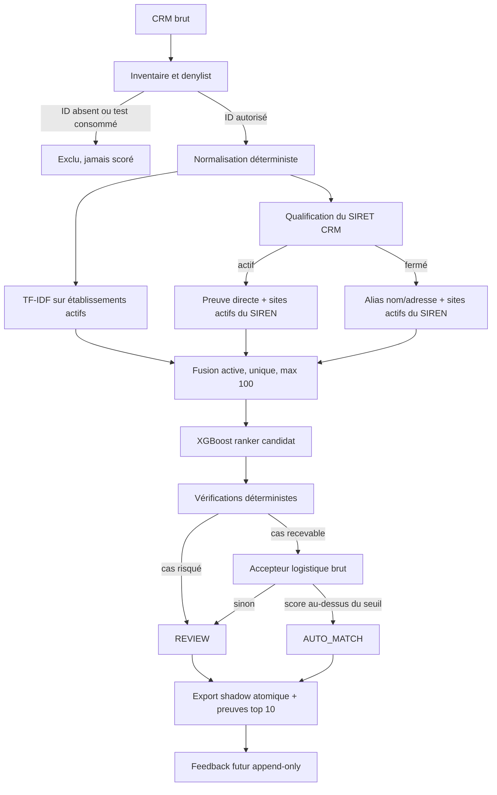

# Contrat V4.1 — matching actif-courant en shadow

Statut : préenregistré avant entraînement et avant exécution shadow.

## 1. But et limites

V4.1 vise un matching vers le **SIRET actif dans le snapshot SIRENE courant**.
Le SIRET présent dans le CRM est une preuve potentiellement utile, jamais une
vérité terrain. Un SIRET fermé peut fournir des alias ou son SIREN, mais ne peut
jamais être proposé comme résultat final.

Le run shadow ne modifie pas le CRM et ne mesure pas une précision réelle :
les lignes disponibles ont déjà participé à des constructions ou benchmarks
historiques. Il sert à vérifier le comportement, les volumes, les motifs de
revue, la latence et le futur mécanisme de retour.

Le test historique et le holdout V4-Fresh sont consommés. Leurs
`crm_record_id` sont inscrits dans une denylist et ne doivent être ni scorés ni
analysés dans V4.1.

## 2. Population autorisée

La population est construite avant toute prédiction :

1. lire le CRM brut sans modifier ses champs ;
2. exclure les lignes sans `SERVICE ID` avec `MISSING_SERVICE_ID` ;
3. exclure tout identifiant présent dans l'ancien test ou le holdout
   V4-Fresh avec `CONSUMED_HOLDOUT` ;
4. refuser le run si un identifiant est dupliqué ;
5. enregistrer les hashes de la source et des deux denylists.

Pour la source actuellement connue, les contrôles attendus sont :

| Catégorie | Lignes |
|---|---:|
| CRM brut | 23 609 |
| `MISSING_SERVICE_ID` | 659 |
| `CONSUMED_HOLDOUT` | 3 925 |
| Autorisées au shadow | 19 025 |

Ces nombres sont des assertions d'intégrité de cette source, pas des constantes
métier réutilisables pour un futur CRM.

## 3. Panel de diagnostic

Le panel est figé avant scoring et contient exactement 500 identifiants
distincts :

- 50 SIRET fermés ayant au moins un établissement actif du même SIREN ;
- 50 SIRET fermés sans établissement actif du même SIREN ;
- 50 SIRET valides absents du snapshot ou invalides ;
- 50 SIRET actifs appartenant à un SIREN multi-site ;
- 300 lignes représentatives parmi les lignes restantes, ordonnées par
  `SHA-256("v4.1-panel:42:" + SERVICE_ID)`.

Les quatre strates difficiles sont rendues disjointes dans l'ordre ci-dessus.
Le panel ne reçoit aucun label de justesse et ne sert pas à ajuster le modèle.

## 4. Retrieval à comparer

Toutes les variantes renvoient uniquement des établissements actifs, uniques,
avec un plafond absolu de 100 :

- **A** : sparse V7 (TF-IDF) limité aux établissements actifs ;
- **B** : A + SIRET CRM actif direct + établissements actifs du même SIREN ;
- **C** : B + recherche active à partir des noms et de l'adresse d'un SIRET
  CRM fermé.

Un filtre `etat_admin = "A"` doit être appliqué avant toute limite SQL. Le
SIRET CRM fermé n'est jamais réinjecté dans les candidats.

Le choix est fait exclusivement sur le dev autorisé, sans score du ranker :

- Recall@100 SIRET exact >= 99,0 % ;
- zéro candidat fermé ;
- aucune régression segmentaire supérieure à 2 points ;
- latence p95 inférieure ou égale à deux fois la baseline ;
- à résultat équivalent à moins d'un point de succès, choisir A, puis B, puis C.

Le holdout consommé ne doit jamais être relu pour ce choix.

## 5. Ranker et accepteur

Le ranker reste un XGBoost candidat. Les identifiants bruts ne sont jamais des
features ; seules des relations booléennes sont permises, par exemple :

- candidat égal au SIRET d'entrée ;
- candidat du même SIREN que l'entrée ;
- SIRET d'entrée actif, fermé, absent ou invalide ;
- provenance retrieval et nombre de canaux concordants.

Les groupes train/dev et les cinq folds OOF sont des composantes connexes
construites avec les liens `input_siren` et `ground_truth_siren`. Aucun SIREN
relié ne peut traverser deux groupes.

L'accepteur V4.1 est une régression logistique standardisée **sans calibration
isotonic**. Son seuil est choisi une fois sur le dev complet pour maximiser la
couverture sous une précision observée SIRET de 99,8 %, avec au moins 100
décisions automatiques. Le score publié est
`ROUTING_SCORE_UNCALIBRATED`, pas une probabilité garantie.

Avant l'accepteur, les vérifications déterministes sont appliquées dans cet
ordre :

1. aucun candidat actif : `REVIEW_NO_ACTIVE_CANDIDATE` ;
2. plusieurs correspondances actives directes :
   `REVIEW_AMBIGUOUS_DIRECT` ;
3. top 1 fermé : `REVIEW_CLOSED_CANDIDATE` ;
4. SIRET d'entrée actif et conflit direct avec un autre top 1 :
   `REVIEW_INPUT_CONFLICT` ;
5. sinon, décision de l'accepteur.

`label_kind` est interdit dans le chemin d'inférence.

## 6. Contrat de sortie

Chaque ligne autorisée produit exactement une décision :

```text
decision: AUTO_MATCH | REVIEW
routing_status: AUTO | REVIEW
predicted_siret: string | null
predicted_siren: string | null
confidence: float
confidence_kind: ROUTING_SCORE_UNCALIBRATED
review_reason: string | null
input_siret: string | null
input_siret_state: ACTIVE | CLOSED | NOT_FOUND | INVALID
evidence_tier: string
candidate_count: integer
shadow_run_id: string
model_bundle_id: string
dataset_manifest_id: string
```

Le répertoire de run est écrit de manière atomique sous :

`/Volumes/CATNAT_DATA/SIRETO_RECALL100/shadow/v4_1/<run_id>/`

Il contient au minimum l'inventaire, les décisions parquet et CSV, les dix
meilleurs candidats, les preuves, le panel, un résumé et un manifeste avec les
hashes de toutes les sorties. Aucun fichier du CRM source n'est modifié.

## 7. Feedback et certification

Les observations futures sont append-only :

- CRM inchangé : `UNKNOWN` ;
- correction explicite vers la proposition : `CONFIRMED` ;
- correction explicite vers un autre SIRET : `CORRECTED`.

Elles ne déclenchent jamais un réentraînement automatique. Un nouveau snapshot
CRM, gelé avant scoring et disjoint des données consommées, sera le seul test
indépendant de V4.1. Avant environ 2 300 décisions AUTO indépendantes auditées
sans erreur, 99,8 % reste une estimation observée et non une garantie.

## 8. Architecture


