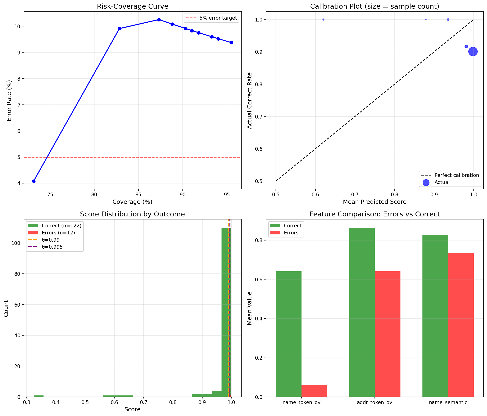

# Diagnostic Quantifie - XGBoost Entity Matching

## Resume Executif

| Metrique | Valeur |
|---|---|
| **Precision@1** | 100.00% |
| **Taux d'erreur (FP)** | 0.00% (0/8) |

---

## 1. Courbe Risk-Coverage

| Seuil theta | Couverture | Erreurs | Taux d'erreur |
|---|---|---|---|
| 0.9 | 50.0% | 0 | 0.0% |
| 0.95 | 50.0% | 0 | 0.0% |
| 0.99 | 50.0% | 0 | 0.0% |
| 0.995 | 50.0% | 0 | 0.0% |

> Couverture calculee comme auto_count / total_count avec total_count=16.
